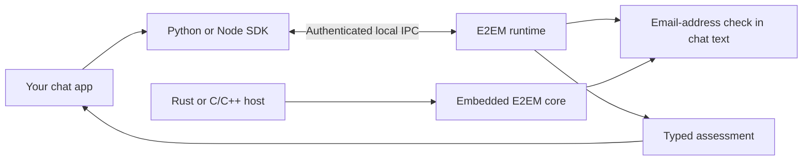
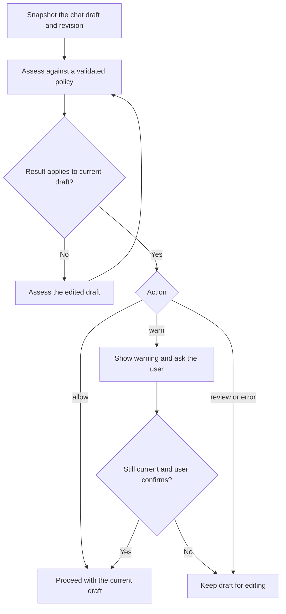

<p align="center"></p>

<p align="center">
  <a href="https://github.com/E2EMorg/e2em/releases"><strong>⬇ Download the runtime</strong></a> ·
  <a href="#try-the-reference-chat">Try the reference chat</a> ·
  <a href="docs/INSTALL.md"><strong>Installation guide</strong></a> ·
  <a href="docs/SDK.md">SDK quick start</a> ·
  <a href="https://e2em.org">The E2EM standard</a>
</p>
<p align="center">
  <a href="https://github.com/E2EMorg/e2em/actions/workflows/ci.yml"></a>
  <a href="https://github.com/E2EMorg/e2em/releases"></a>
  <a href="LICENSE"></a>
  
</p>

### Install E2EM

**Start with [Downloads](https://github.com/E2EMorg/e2em/releases).** Open the newest **developer preview**, choose the file for your computer below, then follow the [installation guide](docs/INSTALL.md). You do not need Rust, a GPU, or a model download to run E2EM.

| Your computer | Download ending | Next step |
| :--- | :--- | :--- |
| Windows · Intel / AMD, 64-bit | `x86_64-pc-windows-msvc.msi` | [Windows setup](docs/INSTALL.md#windows) |
| Mac · Apple Silicon (M-series) | `aarch64-apple-darwin.pkg` | [Mac setup](docs/INSTALL.md#macos) |
| Mac · Intel | `x86_64-apple-darwin.pkg` | [Mac setup](docs/INSTALL.md#macos) |
| Linux · Ubuntu / Debian, 64-bit | `x86_64-unknown-linux-musl.deb` | [Debian / Ubuntu setup](docs/INSTALL.md#linux) |
| Linux · Fedora / RPM, 64-bit | `x86_64-unknown-linux-musl.rpm` | [Fedora setup](docs/INSTALL.md#linux) |

> **Developer preview:** all named categories are accepted for reporting; the bundled runtime evaluates email-address patterns (`pii.email`) and reports other checks as unevaluated. No contextual model is bundled. Installers are unsigned; Windows/macOS may require explicit permission to open them. Application enrolment and startup are separate setup steps. E2EM works inside apps that integrate it; installing the runtime alone does not add protection to other apps. Native platform test results accompany each release. This is an implementation preview of a developing standard.


### What is E2EM?

E2EM is a local assessment interface for **chat and chat messages**. A chat app supplies a policy and a message before sending; the runtime returns a typed result so the app can send it, show a warning, or hold the draft for review. The original text stays intact, and the app controls what happens next.

The first focus is the chat composer and its send flow: assess the current draft, show any warning, and check that the draft is still current before sending. All named policy categories can be submitted for reporting, including categories with weak or unknown model ratings. Ratings describe quality and do not decide which categories people may try. The bundled preview evaluates email-address patterns; a supplied model backend can score other named categories.

This repository contains the **runtime, SDKs, installers, and integration contract**. The [standard and project overview](https://e2em.org) explain the wider effort. Model training, research datasets, and experimental moderation frontends live outside this repository.

### Try the reference chat

From a source checkout with Rust 1.95+:

```sh
cargo run --locked --example runtime_chat
```

Enter a chat message such as `See you at 6!`, then try `You can reach me at alex@example.test`. The second draft triggers a warning before you choose whether to continue. This offline chat accepts messages locally and does not send real messages or require a running daemon. Its [chat policy](examples/chat-policy.json) is a small example, not a required policy. Try other named categories with `cargo run --locked --example runtime_chat -- examples/category-policy.json`. Without a model backend, these categories are reported as unevaluated and the draft is held for review.


---

### Why integrate it into chat?

- **Local processing.** Assessment uses local IPC or an embedded library. It sends no messages to a remote service and creates no telemetry or message cache.
- **One shared runtime.** Enrolled applications share a bounded worker, with separate authenticated principals and policies.
- **Clear outcomes.** Versioned policies, typed errors, coverage, and revision checks let apps make deliberate decisions.
- **Small integrations.** Python and Node clients need no inference dependencies. Rust and C/C++ can embed the core.
- **Predictable resources.** Queues, frames, deadlines, and result sizes are bounded. Idle eviction and memory-pressure handling manage backend lifetime.

### How it fits together



The shared service uses Unix sockets on Linux/macOS and a local named pipe on Windows. Embedded integrations run in the host process. Each app must explicitly enrol before using the service; app display names do not grant access.

### SDKs at a glance

SDK packages are attached to the same [versioned GitHub Releases](https://github.com/E2EMorg/e2em/releases) as the runtime. **PyPI, npm, and crates.io publication is not enabled.** Install the downloaded package or use the source checkout.

| Integration | Requirement | Install from a checkout | Guide |
| :--- | :--- | :--- | :--- |
| Python | Python 3.11+ | `python3 -m pip install ./sdk/python` | [Python SDK](sdk/python/README.md) |
| JavaScript / TypeScript | Node.js 22+ | `npm install ./sdk/node` | [Node SDK](sdk/node/README.md) |
| Rust | Rust 1.95+ | `e2em-runtime` path or tagged Git dependency | [Rust SDK](docs/SDK.md#rust) |
| C / C++ | C ABI 1 | Link `e2em_ffi`; include `e2em.h` | [C ABI](crates/e2em-ffi/README.md) |

For downloaded Python wheels and Node archives:

```sh
python3 -m pip install ./e2em_local-0.1.1-py3-none-any.whl
npm install ./e2em-local-0.1.1.tgz
```

Rust SDK source and native C ABI archives are also included. Python/Node SDKs connect to an installed and enrolled runtime; installing an SDK alone does not start one.

### Assess a chat draft

After [installing the runtime and enrolling your app](docs/INSTALL.md), load the private credentials that setup creates. Do not put credentials in source control. The [complete SDK guide](docs/SDK.md) includes credential paths, Python, TypeScript, Rust, and error handling.

```python
import asyncio
import json
from pathlib import Path
from e2em import Client, E2EMError

async def main():
    credentials = json.loads(
        (Path.home() / ".config/e2em/apps/my-app.json").read_text()
    )  # Linux / macOS; see the guide for Windows.
    policy = json.loads(Path("examples/chat-policy.json").read_text())
    client = await Client.open(**{key: credentials[key] for key in
        ("socket_path", "principal", "secret", "provider")})
    async with client:
        reference = await client.validate_policy(policy)
        request = {
            "api_version": "0.1", "request_id": "draft-1", "direction": "outgoing",
            "message": {"id": "draft", "revision": "1", "speaker": "self",
                        "text": "You can reach me at alex@example.test"},
            "policy_ref": reference,
        }
        try:
            result = await client.assess(request)
        except E2EMError as error:
            print(f"Hold for review: {error.code}")
            return
        if result.applies_to(request):
            print(result.status, result.action)  # assessed warn

asyncio.run(main())
```

### Handle the result



The app must recheck the current snapshot at the actual send boundary, including after warning confirmation. A timeout, unavailable runtime, cancellation, malformed response, or incomplete coverage must hold the action for review. Named categories are not rejected because of model ratings or an allowlist. Unavailable checks are reported as unevaluated; the current preview does not support block policies or platform authority.

### Current capabilities

| Available in 0.1 | Outside this preview |
| :--- | :--- |
| All named categories accepted for reporting | Custom policy text |
| `pii.email` detection; model scores with a supplied embedded backend | Bundled contextual model and per-category evaluation ratings |
| Personal `warn` / `review` policies | Platform enforcement and block policies |
| Preserved original text and optional UTF-8 spans | Message rewriting |
| Authenticated desktop IPC, cancellation, revision checks | Browser extension transport and sandbox brokers |
| Rust core and C ABI; Python and Node clients | OS-supplied providers or automatic provider discovery |

`capabilities()` is authoritative for the running provider. The bundled backend reports `model=none` and `tokenizer=none`; it does not claim model qualification. Account authentication and enrolment separate cooperating apps; they do not isolate secrets from a hostile process running as the same OS user. Read the [security boundaries](docs/runtime/SECURITY.md) before embedding or deploying.

### Build and contribute

```sh
git clone https://github.com/E2EMorg/e2em.git
cd e2em
cargo build --locked --workspace --all-features
cargo run --locked --example runtime_chat
```

The reference chat runs offline and does not send real messages. For an embedded-only build, use `cargo build --locked --no-default-features --lib`. The service is enabled by default; `runtime-probes` adds a diagnostic worker used by resource tests.

```sh
cargo test --locked --workspace --all-features
cargo fmt --all -- --check
cargo clippy --locked --workspace --all-targets --all-features -- -D warnings
python3 -m compileall -q scripts tests sdk/python
python3 -m unittest discover -s tests -p 'test_*.py'
node --test sdk/node/test.mjs
```

See [CONTRIBUTING](CONTRIBUTING.md) for prerequisites, foreign-client checks, schema generation, and release instructions. CI checks Linux, Windows, and macOS; release publication waits for tests and native package lifecycle checks.

### Find your way around

| Looking for… | Start here |
| :--- | :--- |
| Downloads and version notes | [Releases](https://github.com/E2EMorg/e2em/releases) · [Changelog](CHANGELOG.md) |
| Installation, upgrades, and removal | [Install guide](docs/INSTALL.md) · [Package details](docs/runtime/PACKAGING.md) |
| API examples and integration lifecycle | [SDK guide](docs/SDK.md) · [Contract](docs/runtime/CONTRACT.md) |
| Schemas and shared fixtures | [JSON schemas](docs/runtime/schemas) · [Conformance tests](tests/conformance) |
| Trust boundaries and vulnerability reporting | [Runtime security](docs/runtime/SECURITY.md) · [Security policy](SECURITY.md) |
| Platform and resource evidence | [Desktop details](docs/runtime/DESKTOP.md) · [Evidence](docs/runtime/evidence) |
| Contributing and project direction | [Contribution guide](CONTRIBUTING.md) · [Runtime roadmap](docs/ROADMAP.md) |
| The wider standard | [e2em.org](https://e2em.org) |

### License and provenance

Runtime code, SDKs, examples, and documentation in this repository are available under the [MIT License](LICENSE). Third-party dependencies retain their own licenses. No model weights or training datasets are distributed here. The runtime was extracted from the original E2EM research repository; [provenance](docs/ORIGIN.md) records the source revision and changes.
