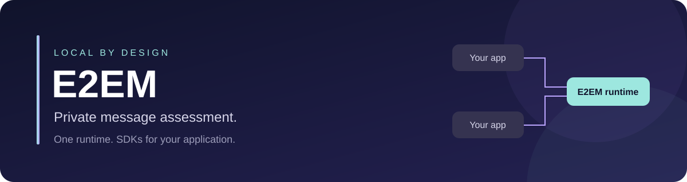
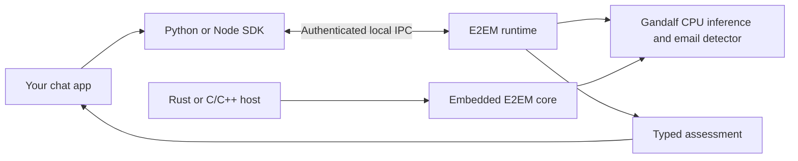
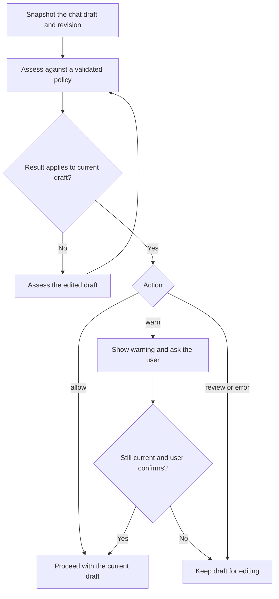

<p align="center"></p>

<p align="center">
  <a href="#try-the-reference-chat"><strong>Try the reference chat</strong></a> ·
  <a href="https://github.com/E2EMorg/e2em/releases"><strong>⬇ Download the runtime</strong></a> ·
  <a href="docs/INSTALL.md"><strong>Installation guide</strong></a> ·
  <a href="docs/SDK.md">SDK quick start</a> ·
  <a href="https://e2em.org">The E2EM standard</a>
</p>
<p align="center">
  <a href="https://github.com/E2EMorg/e2em/actions/workflows/ci.yml"></a>
  <a href="https://github.com/E2EMorg/e2em/releases"></a>
  <a href="LICENSE"></a>
  
</p>

### What is E2EM?

E2EM is a local assessment interface for **chat and chat messages**. Send a message, optionally include earlier conversation, and get a report against the built-in presets. Select a subset or add custom policy text when you need it. Your chat app uses the report to send, warn, or hold a draft for review. The original text stays intact, and the app controls what happens next.

The first focus is chat and its send flow. All 40 built-in presets are selected by default, with no model rating gate. Custom policies can be plain strings; policy files are optional for bulk or advanced configuration.

This repository contains the **runtime, SDKs, installers, and integration contract**. The [standard and project overview](https://e2em.org) explain the wider effort. Model training, research datasets, and experimental moderation frontends live outside this repository.

### Assess a message

After [one-time runtime and app setup](docs/INSTALL.md), the Python SDK loads its local connection settings automatically:

```python
from e2em import assess

report = assess("Hello there!")
print(report.scores)
```

That selects all built-in presets. Context, a preset subset, and custom text are optional:

```python
assess("That sounds good", context=["Shall we meet tomorrow?"])
assess("Hello there!", policies=["identity.hate", "abuse.threat"])
assess("The launch is next week", custom_policies=["Keep launch dates private."])
```

Custom text is added to the defaults. Use `policies=[]` to assess only custom text. No policy JSON file is needed. [Python, Node, and Rust examples](docs/SDK.md) cover persistent clients and result handling.

**Default model:** [Gandalf](https://huggingface.co/krazyjakee/gandalf) runs locally on CPU. Normal setup downloads verified assets; offline installers bundle them. All default policies and custom text can be scored. Missing conversation for `spam.repeat` and truncated evidence remain explicit incomplete coverage. [Model selection and updates](docs/runtime/MODELS.md).

### Try the reference chat

From a source checkout with Rust 1.95+:

```sh
cargo run --locked --example runtime_chat
```

Enter a message such as `See you at 6!`. The demo uses every applicable built-in preset and reports unavailable checks. It runs offline, needs no service credentials, and does not send real messages. Try a subset with `cargo run --locked --example runtime_chat -- --policy pii.email`, or add text with `--custom "Keep launch dates private."`. Add optional conversation with `--context "Earlier message"`; these flags can be repeated.

### Install E2EM

**Start with [Downloads](https://github.com/E2EMorg/e2em/releases).** Open the newest release, choose the file for your computer below, then follow the [installation guide](docs/INSTALL.md). You do not need Rust, a GPU, or Python inference dependencies. Normal setup downloads Gandalf; choose an `-offline-` installer to include its weights.

| Your computer | Download ending | Next step |
| :--- | :--- | :--- |
| Windows · Intel / AMD, 64-bit | `x86_64-pc-windows-msvc.msi` | [Windows setup](docs/INSTALL.md#windows) |
| Mac · Apple Silicon (M-series) | `aarch64-apple-darwin.pkg` | [Mac setup](docs/INSTALL.md#macos) |
| Mac · Intel | `x86_64-apple-darwin.pkg` | [Mac setup](docs/INSTALL.md#macos) |
| Linux · Ubuntu / Debian, 64-bit | `x86_64-unknown-linux-musl.deb` | [Debian / Ubuntu setup](docs/INSTALL.md#linux) |
| Linux · Fedora / RPM, 64-bit | `x86_64-unknown-linux-musl.rpm` | [Fedora setup](docs/INSTALL.md#linux) |

> Installers are unsigned; Windows/macOS may require permission to open them. Enrolment and startup remain explicit. E2EM works inside apps that integrate it. Native inference and installer reports accompany each release. The developing standard does not claim per-category model qualification.

---

### Why integrate it into chat?

- **Local processing.** Assessment uses local IPC or an embedded library. It sends no messages to a remote service and creates no telemetry or message cache.
- **One shared runtime.** Enrolled applications share a bounded worker, with separate authenticated principals and policies.
- **Clear outcomes.** Versioned policies, typed errors, coverage, and revision checks let apps make deliberate decisions.
- **Small integrations.** Python and Node clients need no inference dependencies. Rust and C/C++ can embed the core.
- **Predictable resources.** Queues, frames, deadlines, and result sizes are bounded. Idle eviction and memory-pressure handling manage backend lifetime.

### How it fits together



The shared service uses Unix sockets on Linux/macOS and a local named pipe on Windows. Embedded integrations run in the host process. The SDK loads the local settings created during app enrolment. This authenticates apps sharing the service; it is not a user account or cloud API key. Embedded Rust/C use needs no service credentials.

Managed setup enables [background runtime updates](docs/runtime/UPDATING.md). Update checks and downloads wait for an idle runtime; restart waits for assessments and replies to finish. Updates preserve credentials and keep the previous working version for rollback. Setup offers an opt-out for offline installations.

### SDKs at a glance

SDK packages are attached to the same [versioned GitHub Releases](https://github.com/E2EMorg/e2em/releases) as the runtime. **PyPI, npm, and crates.io publication is not enabled.** Install the downloaded package or use the source checkout.

| Integration | Requirement | Install from a checkout | Guide |
| :--- | :--- | :--- | :--- |
| Python | Python 3.11+ | `python3 -m pip install ./sdk/python` | [Python SDK](sdk/python/README.md) |
| JavaScript / TypeScript | Node.js 22+ | `npm install ./sdk/node` | [Node SDK](sdk/node/README.md) |
| Rust | Rust 1.95+ | `e2em-runtime` path or tagged Git dependency | [Rust SDK](docs/SDK.md#rust) |
| C / C++ | C ABI 1 | Link `e2em_ffi`; include `e2em.h` | [C ABI](crates/e2em-ffi/README.md) |

For downloaded Python wheels and Node archives:

```sh
python3 -m pip install ./e2em_local-0.1.2-py3-none-any.whl
npm install ./e2em-local-0.1.2.tgz
```

Rust SDK source and native C ABI archives are also included. Python/Node SDKs connect to an installed and enrolled runtime; installing an SDK alone does not start one.

### Handle the result



The app must recheck the current snapshot at the actual send boundary, including after warning confirmation. A timeout, unavailable runtime, cancellation, malformed response, or incomplete coverage must hold the action for review. Named categories are not rejected because of model ratings or an allowlist. Unavailable checks are reported as unevaluated; the current preview does not support block policies or platform authority.

### Current capabilities

| Available in 0.1 | Outside this preview |
| :--- | :--- |
| All 40 default presets, named categories, and custom policy text | Platform enforcement |
| Gandalf default, custom model selection and verified model updates | Per-category evaluation ratings |
| Personal `warn` / `review` policies | Platform enforcement and block policies |
| Preserved original text and optional UTF-8 spans | Message rewriting |
| Authenticated desktop IPC, cancellation, revision checks | Browser extension transport and sandbox brokers |
| Rust core and C ABI; Python and Node clients | OS-supplied providers or automatic provider discovery |

`capabilities()` is authoritative for the running provider. The service reports its model and tokenizer identity; model qualification remains a separate evaluation task. Account authentication and enrolment separate cooperating apps; they do not isolate secrets from a hostile process running as the same OS user. Read the [security boundaries](docs/runtime/SECURITY.md) before embedding or deploying.

### Build and contribute

```sh
git clone https://github.com/E2EMorg/e2em.git
cd e2em
cargo build --locked --workspace --all-features
cargo run --locked --example runtime_chat
```

The reference chat runs offline and does not send real messages. For an embedded-only build, use `cargo build --locked --no-default-features --lib`. The service is enabled by default; `runtime-probes` adds a diagnostic worker used by resource tests.

```sh
cargo test --locked --workspace --all-features
cargo fmt --all -- --check
cargo clippy --locked --workspace --all-targets --all-features -- -D warnings
python3 -m compileall -q scripts tests sdk/python
python3 -m unittest discover -s tests -p 'test_*.py'
node --test sdk/node/test.mjs
```

See [CONTRIBUTING](CONTRIBUTING.md) for prerequisites, foreign-client checks, schema generation, and release instructions. CI checks Linux, Windows, and macOS; release publication waits for tests and native package lifecycle checks.

### Find your way around

| Looking for… | Start here |
| :--- | :--- |
| Downloads and version notes | [Releases](https://github.com/E2EMorg/e2em/releases) · [Changelog](CHANGELOG.md) |
| Installation, upgrades, and removal | [Install guide](docs/INSTALL.md) · [Package details](docs/runtime/PACKAGING.md) |
| API examples and integration lifecycle | [SDK guide](docs/SDK.md) · [Contract](docs/runtime/CONTRACT.md) |
| Schemas and shared fixtures | [JSON schemas](docs/runtime/schemas) · [Conformance tests](tests/conformance) |
| Trust boundaries and vulnerability reporting | [Runtime security](docs/runtime/SECURITY.md) · [Security policy](SECURITY.md) |
| Platform and resource evidence | [Desktop details](docs/runtime/DESKTOP.md) · [Evidence](docs/runtime/evidence) |
| Contributing and project direction | [Contribution guide](CONTRIBUTING.md) · [Runtime roadmap](docs/ROADMAP.md) |
| The wider standard | [e2em.org](https://e2em.org) |

### License and provenance

Runtime code, SDKs, examples, and documentation in this repository are available under the [MIT License](LICENSE). Third-party dependencies retain their own licenses. Gandalf deployment weights are distributed with offline installers and release assets under the owner-authorized MIT licence, with upstream notices retained. Training datasets are not distributed. The runtime was extracted from the original E2EM research repository; [provenance](docs/ORIGIN.md) records the source revision and changes.
